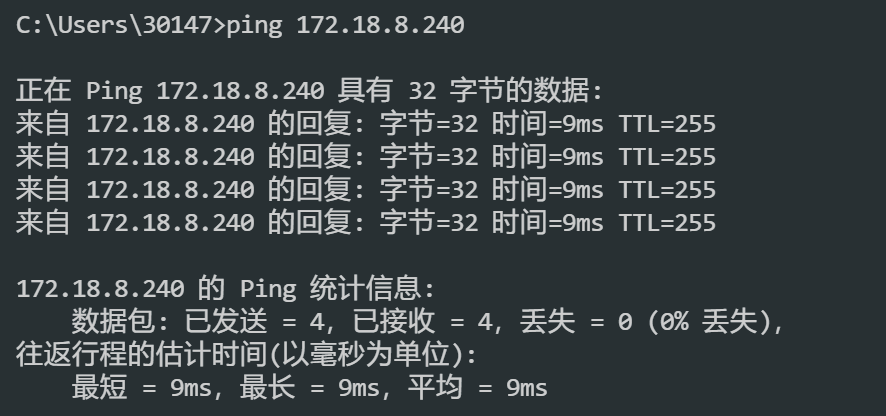

# 智能实验室器材管理柜-LwIP以太网部分

> 本工程为智能实验室器材管理柜的以太网通信模块，基于STM32F429IGTx和LwIP协议栈实现。目前已完成以太网驱动的移植和LwIP协议栈的配置，已验证网络层功能，并具备TCP/IP应用开发基础。

> [项目地址](https://github.com/Moyaoyyy/git-github.com-Moyaoyyy-SmartEquipmentCabinet_LwIP-STM32Net.git) 为保证获取项目的持续更新，请前往该地址fetch最新代码。

## 1、目录结构

```
mcu/
├── bsp/ETH/                        # 以太网驱动相关文件
│   ├── Inc/bsp_eth_port.h
│   └── Src/bsp_eth_port.c
│
├── middleware/LwIP/                # LwIP协议栈相关文件
│   ├── port/                       # LwIP端口移植文件
│   │   ├── sys_arch_port.c/.h      # FreeRTOS适配（信号量、邮箱、线程）
│   │   ├── ethernetif.c/.h         # 以太网接口驱动（DMA、收发包）
│   │   └── ...
│   └── src/                        # LwIP核心源文件
│       ├── api/                    # Netconn/Socket API 
│       ├── core/                   # TCP/UDP/IP/ICMP 协议实现
│       ├── netif/                  # 网络接口相关实现
│       └── ...
│
├── app/                           
│   ├── app_lwip/                   # LwIP应用示例
│   |   ├── netconf.c/.h            # 网络初始化、IP配置、DHCP管理
│   |   └── tcp_echoclient.c/.h     # TCP客户端应用示例
│   |   └── lwipopts.h              # lwIP用户配置文件
│   └── ...
│
├── project                         # 存储工程构建文件           
│   ├── arm-gnu-none-eabi.cmake     # 指定工程运行环境
│   └── CMakeLists.txt              # 指定工程结构
│
├── main.c                          # 主程序入口
│
├── LICENSE                         # 许可证文件
│
└── README.md                       # 工程说明文件    
```

## 2、LwIP移植架构层次关系图

```plaintext
+---------------------+
|     Application     |
+---------------------+  <-- 用户应用层（TCP/UDP客户端等）
|  mcu/app/app_lwip/  |
+---------------------+
           |
           |调用
           v
+---------------------+
|      lwIP Stack     |
+---------------------+  <-- LwIP协议栈层（TCP/IP协议实现）
| middleware/LwIP/src/|
+---------------------+
           |
           |需要
           v
+---------------------+
|   OS Abstraction    |
+---------------------+  <-- 操作系统移植层（FreeRTOS适配）
|middleware/LwIP/port/|
+---------------------+
           |
           |调用
           v
+---------------------+
|   Hardware Driver   |
+---------------------+  <-- 硬件驱动层（以太网驱动）
|     mcu/bsp/ETH/    |
+---------------------+
           |
           |操作
           v
+---------------------+
|      Hardware       |  <-- 硬件层（STM32以太网外设）
+---------------------+
```
## 3、主要功能说明
- **以太网驱动（bsp_eth_port.c/h）**：实现对STM32F429IGTx以太网外设的初始化、配置和数据收发功能，支持DMA模式，提高数据传输效率。
- **LwIP协议栈移植（sys_arch_port.c/h, ethernetif.c/h）**：完成LwIP协议栈在FreeRTOS操作系统上的移植，提供信号量、邮箱和线程等操作系统抽象接口。
- **网络配置（netconf.c/h）**：实现网络接口的初始化、IP地址配置（静态IP和DHCP）以及网络状态管理功能。
- **TCP客户端示例（tcp_echoclient.c/h）**：提供一个简单的TCP客户端应用示例，演示如何使用LwIP进行网络通信。
- **用户配置文件（lwipopts.h）**：定义LwIP协议栈的各种参数和选项，以适应具体应用需求。
- **工程构建文件（CMakeLists.txt, arm-gnu-none-eabi.cmake）**：配置工程的编译环境和构建选项，确保代码能够正确编译和链接。
- **主程序入口（main.c）**：初始化系统和LwIP协议栈，启动网络通信任务。
  
  > **!!!注意!!!**

  >  在 main.c 中调用 **LwIP_Init()** 初始化LwIP 协议栈时，由于 **LwIP_Init()** 内部需要使用 FreeRTOS 的信号量和线程，必须在调度器启动之后才能调用，且不能在临界区内。当前工程的 main.c 中，将**除LwIP协议栈**以外的外设初始化都封装到了 **BSP_Init()** ，如果在 **BSP_Init()** 中调用了 **LwIP_Init()**，会导致 FreeRTOS 的断言失败。**移植时务必这一点**。
- **调试支持（debug.h/c）**：提供调试信息输出功能，方便开发过程中进行问题排查。

## 4、当你拿到本工程，你应该如何合并到主分支？

### ~~0.你应该直奔README.md，这不是常识吗~~

### 1. 先清楚本工程所使用的开发环境
本工程使用 STM32 **标准外设库**开发，基于 FreeRTOS 操作系统和 LwIP 协议栈实现。使用ARM GCC作为编译器，CMake作为构建工具，如果你恰好也使用这套工具链，~~你真幸运~~，直接把本工程的代码复制到你的主分支即可。
> 如果你对本工程的开发环境感兴趣，欢迎stars本工程的~~前置任务~~ [GitHub](https://github.com/Moyaoyyy/STM32F429IGT6-Std-Template.git)

### 2. 如果你使用ARM MDK，那应该怎么办？
如果你使用ARM MDK，那你不能直接Ctrl  C/V 将本工程~~移植~~复制过去，你需要在已有的FreeRTOS工程中，手动添加LwIP相关文件，具体操作可以参考下面的步骤：

 (1) 将 /middleware/LwIP 源码添加到工程的**文件路径**下。
 
 (2) 在你的 ARM-MDK 工程中创建分组存放LwIP源码，分组命名按照你的喜好来。~~这不重要~~

 (3) 在工程中添加LwIP头文件路径，并且把C99模式也勾选上。~~这很重要~~
 > 点击Options for Target 'your_target' -> C/C++ -> Include Paths -> 添加路径
 
 > 点击Options for Target 'your_target' -> C/C++ -> Language -> 选择C99
    
 (4) 把LwIP的用户配置文件 lwipopts.h 添加到你的工程中，并根据你的需求修改配置参数。
    
 (5) 将 /mcu/bsp/ETH/ 下的以太网驱动文件 bsp_eth_port.c/h 添加到你的工程中。
        
 (6) 将 /mcu/app/app_lwip/ 下的 netconf.c/h 和 tcp_echoclient.c/h 添加到你的工程中。
 > 我建议分别创建bsp、app两个分组存放这些文件，~~这样好看~~
    
 (7) 在 main.c 中调用网络初始化函数，启动LwIP协议栈和TCP客户端任务。

### 3. 如果你使用其他开发环境，那应该怎么办？
自己想办法，既然选择了其他开发环境，那就说明你有能力移植LwIP协议栈到你的工程中。

## 5、运行示例
 (1) 查询当前局域网的IP地址段，以及可用IP地址。
 
 (2) 修改 /mcu/app/app_lwip/netconf.c 中的静态IP配置，或者启用DHCP功能，让设备自动获取IP地址。
 
 (3) 编译并下载程序到STM32F429IGTx开发板，确保以太网接口已连接到局域网。
 
 (4) 使用Ping命令测试设备是否在线。

如果Ping通，说明LwIP协议栈和以太网驱动工作正常。Ping结果如下所示：



 ~~(5)到此为止了，我只完成了LwIP的移植并适配FreeRTOS，具体的应用开发还没写，请耐心等待后续commit。~~

## 6、许可证
本工程采用 [MIT](LICENSE) 许可证，欢迎自由使用和修改，但请保留原作者信息。

## 7、联系方式
- @author: [Yukikaze](https://github.com/Moyaoyyy)
- @email: moyaoyyy@gmail.com

欢迎提出issue或pull request，一起完善本工程！


